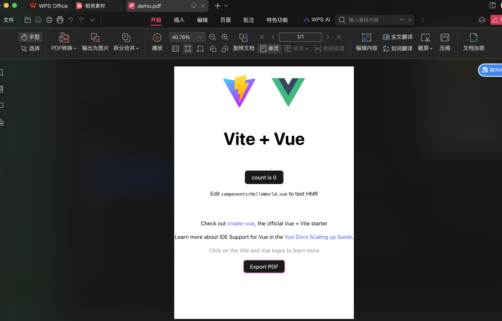

# modern-html2pdf

<a href="https://www.npmjs.com/package/@vincent-the-gamer/modern-html2pdf" target="_blank">
    
</a>

<a href="https://github.com/Vincent-the-gamer/modern-html2pdf/blob/master/LICENSE" target="_blank">
    
</a>

Work in progress.

## Why?

This repo is inspired by [html2pdf.js](https://github.com/eKoopmans/html2pdf.js), which uses `html2canvas` and `jsPDF` to generate PDFs. 

But there are too much problem with `html2canvas`:

- SVGs are not supported
- Custom fonts couldn't show correctly.
- ...

These can be gracefully fixed using `modern-screenshot`.

So this is why I created this repo.

## Usage
Get package from npm:
```shell
npm i modern-htmlpdf
```

### Quickly Generate PDF
This will screenshot your HTML Element, then generate a PDF file with a simple process.

to customize your process, see [Customize your process](#customize-your-process)

```typescript
import { ModernHtml2Pdf } from "modern-html2pdf"

const el = document.getElementById("el")!
const convertor = new ModernHtml2Pdf(el)
await convertor.quickGenerate({
    fileName: "demo",  // transform to: demo.pdf
    // these options are definitely type definitions of `domToCanvas` function in modern-screenshot
    // https://github.com/qq15725/modern-screenshot/blob/main/src/options.ts
    domToCanvasConfig: {
        backgroundColor: "white",
        style: {
            color: "black"
        }
    },
    // these options are definitely type definitions of `jsPDF`, see below.
    jsPDFConfig: {
        orientation: "p",
        unit: "mm",
        format: "a4"
    }
})
```

jsPDFOptions: 
```typescript
export interface jsPDFOptions {
    orientation?: "p" | "portrait" | "l" | "landscape";
    unit?: "pt" | "px" | "in" | "mm" | "cm" | "ex" | "em" | "pc";
    format?: string | number[];
    compress?: boolean;
    precision?: number;
    filters?: string[];
    userUnit?: number;
    encryption?: EncryptionOptions;
    putOnlyUsedFonts?: boolean;
    hotfixes?: string[];
    floatPrecision?: number | "smart";
}
```

### Customize your process
You can get each function of `jsPDF` or `modern-screenshot` from `ModernHtml2Pdf` instance.

```typescript
import { ModernHtml2Pdf } from "modern-html2pdf"
const el = document.getElementById("el")!
const convertor = new ModernHtml2Pdf(el)

// domToCanvas
const canvas = await convertor.domToCanvas({
    // domToCanvas options
    ...
})

// jsPDF
const pdf = convertor.jsPDF({
    // jsPDF options
    ...
})

// domToPng
const png = await convertor.domToPng({
    // domToPng options
    ...
})
...
```

So that, you can handle every single component to get more customizations.

Example: 
```typescript
const canvas = await convertor.domToCanvas({
    // domToCanvas options
    ...
})

const ctx = canvas.getContext('2d')

// blah blah blah
...
```

## Preview

You can generate it yourself in `packages/playground`.

